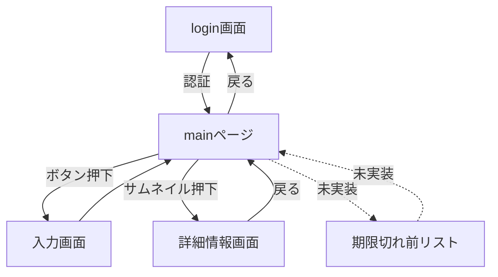
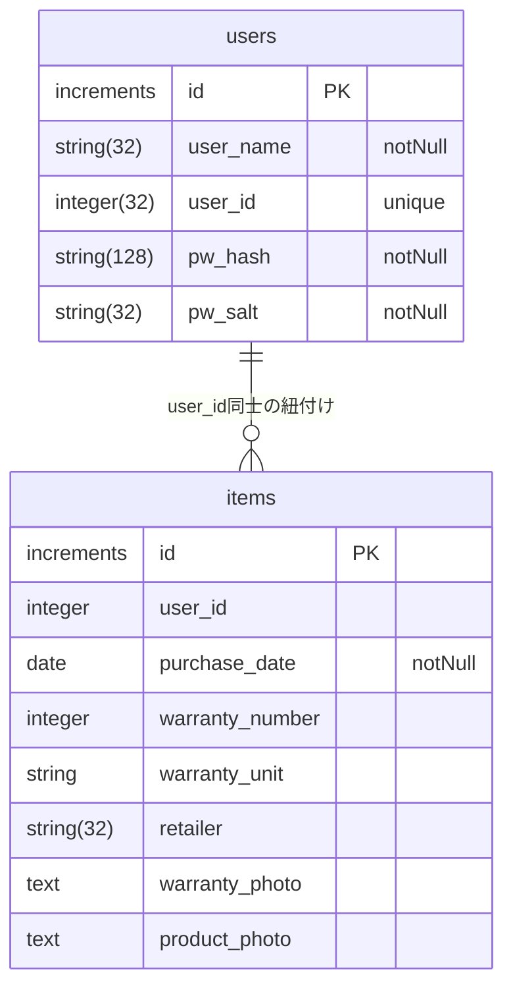
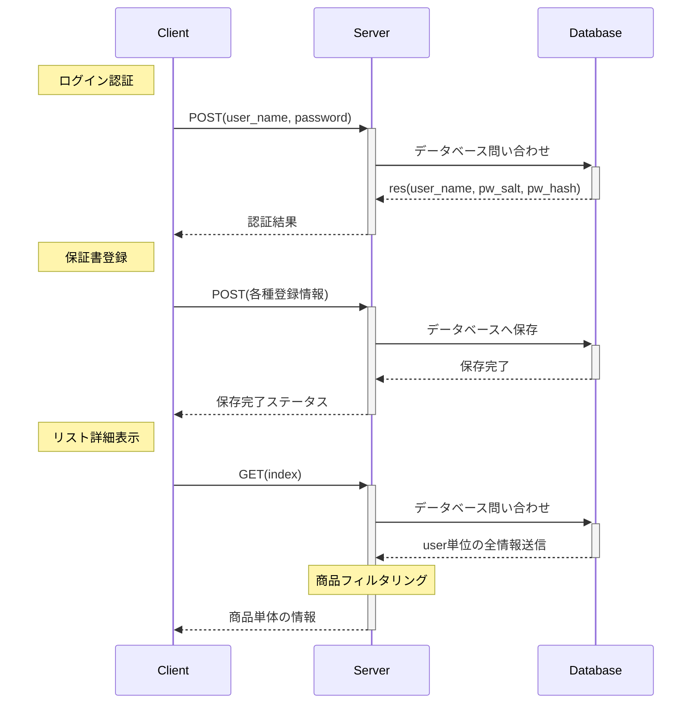

# Lenzzzz とは

皆さん、保証書ちゃんと管理できていますか？

1 年保証や 3 年保証のものだったり、

家電の長期保証で 7 年の物があったりすると思います。

いざ使いたいときに、「あれ？保証書どこだ？」となる人はきっと多いハズ。

アプリで管理できたら良いと思いませんか？

そんなアプリ。開発中です。

## デプロイ先 URL

このアプリは、フロントエンドとバックエンドのデプロイ先が存在します。

render でデプロイしている関係上、アプリをしばらく起動していないとサーバーが落ちてしまうため、

まず、バックエンド側のデプロイ先を開いてください。

`https://lenzzzz.onrender.com`

画面上に、`Cannot GET /`が表示されたらサーバーが立ち上がります。

続いて、フロントエンド側の、

`https://lenzzzz-front.onrender.com/`二アクセスしてアプリをお楽しみください。

現在、新規登録ユーザーの設定が追加できない仕様のため、
/db/seeds 内に格納されているファイルから記入するべき内容を読み解いてください。

参考資料(miro リンク)

`https://miro.com/welcomeonboard/Rm9TbTJidFhkWXNDeElQbUYxbkZkbVRrQU9WeDRaREdpbHQ0ZnpCVW5iaFoxZ1g5b1pwWEFFRFVLdmN5M0dlT3wzNDU4NzY0NTcxMTQwMTcwMDQzfDI=?share_link_id=95512790893`

## 初期セットアップ手順

このアプリは、フロントエンド側のファイルとバックエンド側のファイルがそれぞれの Repository に分かれています。

こちらの Repository は、バックエンド側になります。

〜バックエンド側のセットアップ手順〜

1. 開発環境の場合、postgresql などの DB を作成
2. ルート直下に`.env`ファイルの作成
3. 2 で作成した DB と接続するために`.env`ファイル下記内容を記述
   1. DB_NAME=[**あなたの環境に合わせてください**]
   2. DB_USER=[**あなたの環境に合わせてください**]
   3. DB_PASSWORD=[**あなたの環境に合わせてください**]
   4. NODE_ENV=development
   5. DEVELOPMENT_FRONTEND_URL=[http://localhost:5173/など]
4. `npm run build`を実行(マイグレーション、シーディングまで完了します)
5. `npm run dev`を行うことで nodemon を用いてサーバーが立ち上がります。

〜フロントエンドのセットアップ手順〜

1. `https://github.com/TakahashiTatsuhiro/Lenzzzz_frontend`にアクセスしてください
2. 上記 Repository を`git clone ~~`してください
3. `cd Lenzzzz_frontend`
4. ルート直下に`.env`ファイルを作成してください
5. `VITE_DEVELOPMENT_BACKEND_URL=http://localhost:3000など`のように、バックエンド側のサーバーのリンク先を記述してください
6. `npm i`
7. `npm run dev`

で、Vite のサーバーが立ち上がります。

初期設定のままであれば、`http://localhost:5173/`にアクセスしていただき、

アプリをお楽しみください。

## デプロイに向けて

フロントエンドとバックエンドのレポジトリを分割している都合上、

Render 等でデプロイする場合は、

- フロントエンド用の静的ファイルのサイト
- バックエンド用のアプリケーション用サイト
- DB

の 3 種類必要になります。

環境変数はそれぞれ、

フロントエンド

- `VITE_PRODUCTION_BACKEND_URL: https://バックエンドのurl.com`
- .env file 内に、`VITE_REACT_APP_BACKEND_URL=https:/バックエンドのurl.com`

バックエンド

- `DATABASE_URL: https://フロントエンドのurl.com`
- `NODE_ENV: production`
- `PRODUCTION_FRONTEND_URL: https://フロントエンドのurl.com`

をそれぞれ記入してください。

## 画面遷移イメージ

- login 画面
- user 毎のメイン画面(登録しているアイテムが表示される)
  - 登録したアイテムの情報詳細画面
- 入力画面と登録ボタン(POST メソッド)
- (いつの日かきっと実装)期限切れ前昇順リスト

~画面遷移のイメージ~

## ER 図

user 管理を行う users テーブルと、各 user が登録したアイテムの情報を格納する items テーブルを使用します。

## シーケンス図

データの挙動について簡単に作図する

## 機能作成優先順位

- [x] 1. サムネイル押下による商品詳細ページ遷移
- [ ] 2. passportjs によるログイン認証の実装
- [ ] 3. 期限リストの表示
- [ ] 4. CSS などの装飾
